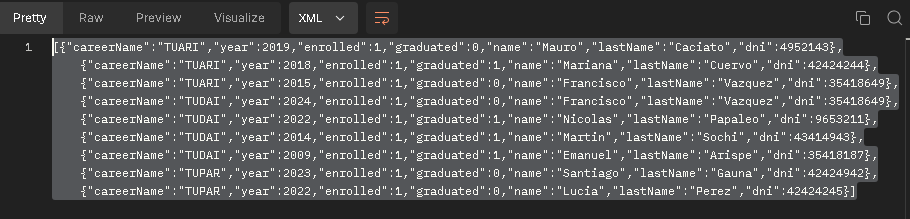

# Arquitecturas Web Tp3 SpringBoot-2024

## Proyecto de Registro de Estudiantes

Este proyecto consiste en la creación de una API REST utilizando Spring Boot y JPA para gestionar un registro de estudiantes. La aplicación permite realizar diversas operaciones como dar de alta estudiantes, matricularlos en carreras, consultar la información de los estudiantes y generar reportes sobre inscriptos y egresados por carrera, los mismos metodos que en la version previa a este se utilizaba JPA pero haciendo consultas por medio de querys JPQL y no utilizando la potencia que esta tecnologia ofrece.

### Tecnologías utilizadas
**Spring Boot:** Framework para la construcción de aplicaciones Java basadas en microservicios.
JPA (Java Persistence API): Para el mapeo objeto-relacional y la persistencia de datos en la base de datos.

**Postman:** Herramienta utilizada para probar los endpoints de la API.


## Estructura del proyecto

La estructura del proyecto está organizada de la siguiente manera:

## Introducción
Este trabajo práctico tiene como objetivo implementar un sistema de registro de estudiantes con las siguientes características:

- Dar de alta estudiantes con su información personal y académica.
- Matricular estudiantes en diversas carreras.
- Recuperar información detallada sobre estudiantes, carreras y generar reportes.

Utilizando Spring Boot como el framework base para la creación de la API, junto con JPA para la persistencia de los datos es posible realizar los objetivos nombrados anteriormente.

Se han implementado servicios, controladores y repositorios que se comunican para ofrecer las funcionalidades de la API.

### Funcionamiento de Spring Boot
El flujo general de la aplicación sigue el patrón de diseño MVC (Model-View-Controller).

- Los controladores reciben las solicitudes HTTP y actúan como intermediarios entre la capa de presentación y la lógica de negocio.
- Los servicios contienen la lógica de negocio, y son los responsables de procesar las solicitudes y comunicarse con la capa de persistencia.
- Los repositorios actúan como interfaces entre la aplicación y la base de datos, facilitando el acceso a las entidades JPA.

## Configuración y utilización de la API

### Ejecucion

Para levantar el contenedor, ejecutar el comando en la terminal dentro del directorio donde está el archivo docker-compose.yml:
        
    docker-compose -f mySQLdocker.yml up

Una vez que el contenedor de la base de datos esté corriendo, el siguiente paso es ejecutar la aplicación Spring Boot.

    C:\Users\fran\Desktop\Tp3Arqui\src\main\java\com\tudai\integrador3\Integrador3Application.java

Una vez ejecutado esperar a que la ejecución finalice para utilizar las consultas,los datos de las tablas son previamente
cargados de forma automatica en la inilizacion del framework.

La respuesta a la mayoria de las solicitudes es por medio de un DTO, exponiendo los datos que son de relevancia sin
exponer la estructura interna de las entidades.

## Utilizando la API

La aplicacion se encuentra disponible en la siguiente direccion

    localhost:8080/api

### Endpoints:

1. Dar de alta un estudiante

Permite registrar un nuevo estudiante en el sistema.

    Método HTTP: POST
    URL: /students
    Body (JSON)
    
```json
{
  "dni": 41385214,
  "idLibreta": 25431,
  "name": "Mariano",
  "lastName": "Pallero",
  "years": 40,
  "gender": "M",
  "city":{"id":1}
}
```
    Cuerpo respuesta CREATED 201
```json
{
    "dni": 41385214,
    "id_libreta": 25431,
    "name": "Mariano",
    "lastName": "Pallero",
    "years": 40,
    "gender": "M",
    "city": "Tandil"
}
```
Ante falta de campos o incorrecta solicitud
    
    Cuerpo respuesta BAD REQUEST 400
```json
{
    "message": "Error al ingresar el estudiante"
}
```

2. matricular un estudiante en una carrera

Permite matricular un estudiante en una carrera

    Método HTTP: POST
    URL: /courses/enroll
    Body (JSON)

```json
{
  "studentId": 35418649,
  "careerId": 1 
}
```
    Cuerpo respuesta OK 201
```json
{
  "studentId": 35418649,
  "careerId": 1,
  "startDate": "2024-10-11",
  "finishDate": null,
  "graduated": false
}
```
Ante falta de campos o incorrecta solicitud

    Cuerpo respuesta BAD REQUEST 400
```json
{
    "message": "Error al asignar la carrera",
    "details"
}
```
3. Recuperar todos los estudiantes, y especificar algún criterio de ordenamiento simple.
    Devuelve lista de estudiantes ordenados por edad

        localhost:8080/api/students/years/ASC   
 
        Método HTTP: GET
        URL: /students/order/direction
        Body (JSON)

        Cuerpo de respuesta 200 OK
    
    ```json
        {
      "dni": 42424942,
      "id_libreta": 5,
      "name": "Santiago",
      "lastName": "Gauna",
      "years": 24,
      "gender": "M",
      "city": "Tandil"
    },
    {
    "dni": 42424244,
    "id_libreta": 7,
    "name": "Mariana",
    "lastName": "Cuervo",
    "years": 26,
    "gender": "F",
    ```
        siguientes datos....


4.  Recuperar un estudiante, en base a su número de libreta universitaria

    
    localhost:8080/api/students/libreta/5

        Método HTTP: GET
        URL: /students/libreta/idLibreta
        Body (JSON)

        Cuerpo de respuesta 200 OK

```json
    {
    "dni": 42424942,
    "id_libreta": 5,
    "name": "Santiago",
    "lastName": "Gauna",
    "years": 24,
    "gender": "M",
    "city": "Tandil"
    }
```

Ante falta de campos o incorrecta solicitud

    Cuerpo respuesta 404 NOT FOUND

5.  Recuperar todos los estudiantes, en base a su género.

        localhost:8080/api/students/gender/M
        
        Método HTTP: GET
        URL: /students/gender/gender
        Body (JSON)
        
        Cuerpo de respuesta 200 OK

```json
{
        "dni": 85214,
        "id_libreta": 2431,
        "name": "Mariano",
        "lastName": "Pallero",
        "years": 40,
        "gender": "M",
        "city": "Tandil"
    },
    {
        "dni": 4952143,
        "id_libreta": 3,
        "name": "Mauro",
        "lastName": "Caciato",
        "years": 33,
        "gender": "M",
```
    siguientes datos..

Ante error de busqueda

    Cuerpo de respuesta 400 BAD REQUEST

```json
  {
  "message": "Error al buscar estudiante por genero",
  "details"
  }
```

6.  Recuperar las carreras con estudiantes inscriptos, y ordenar por cantidad de inscriptos.

        localhost:8080/api/careers/inscripts
        
        Método HTTP: GET
        URL: /inscripts
        Body (JSON)
        
        Cuerpo de respuesta 200 OK

```json
    {
      "idCareer": 1,
      "name": "TUDAI",
      "countStudents": 4
    },
    {
      "idCareer": 2,
      "name": "TUARI",
      "countStudents": 3
    }
```

7. Recuperar los estudiantes de una determinada carrera, filtrado por ciudad de residencia.

        localhost:8080/api/students/career/1/city/1

        Método HTTP: GET
        URL: /students/career/{careerId}/city/{cityId}
        Body (JSON)
        
        Cuerpo de respuesta 200 OK

```json
    {
      "dni": 35418187,
      "id_libreta": 1,
      "name": "Emanuel",
      "lastName": "Arispe",
      "years": 34,
      "gender": "M",
      "city": "Tandil"
    },
    {
        "dni": 35418649,
        "id_libreta": 2,
        "name": "Francisco",
        "lastName": "Vazquez",
        "years": 33,
        "gender": "M",
        "city": "Tandil"
    }
```
    siguientes datos..


8.  Generar un reporte de las carreras, que para cada carrera incluya información de los
    inscriptos y egresados por año. Se deben ordenar las carreras alfabéticamente, y
    presentar los años de manera cronológica.


    localhost:8080/api/careers/report

    Método HTTP: GET
    URL: /students/career/{careerId}/city/{cityId}
    Body (JSON)
    
    Cuerpo de respuesta 200 OK




    


